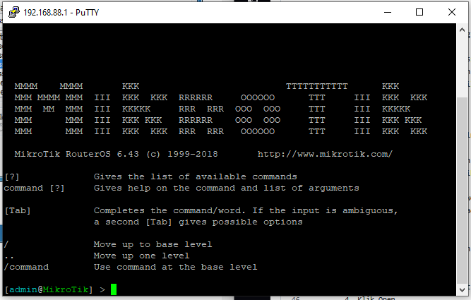

# LAB-1
Senin 11 Agustus 2025

Untuk logging in ke Mikrotik ada beberapa cara:
1. Winbox
2. WebFig
3. Telnet
4. SSH
5. FTP (filezilla)
6. Console
7. Tik App

# 1. Winbox
   Cara pertama yaitu mengunakan aplikasi winbox, dapat didownload di mikrotik.com. Berikut langkah-langkah loginnya:
   1. Buka WinBox
   2. Pindah ke tab "Neighbors"
   3. Setelah muncul, klik pada MAC Address
   4. Isi Login: admin
          Password: (kosong)
   5. Lalu klik Connect
   6. Jika berhasil, akan muncul tampilan seperti ini.

# 2. WebFig
  Cara kedua yaitu mengunakan WebFig (browser), berikut langkah-langkahnya:
    1. Buka Browser
    2. Pada URL bar, ketik IP Address (default Mikrotik) 192.168.88.1
    3. Isi Login dan password, Login "admin" password dikosongkan.
    4. Jika berhasil, akan ada tampilan GUI ROuterOS nya

# 3. Telnet
   Cara ketiga adalah mengunakan Telnet pada Putty, berikut ini langkahnya:
      1. Buka Putty
      2. Pilih other dan Di dropdown selection, pilih Telnet
      3. Ketik IP Address default Mikrotik, 192.168.88.1 dan Port 22 (default Mikrotik)
      4. Klik Open
      5. Login admin dan tanpa password
      6. Jika berhasil, nanti akan ada tampilan terminal dengan tulisan "Mikrotik" seperti ini.

# 4.SSH
   Cara selanjutnya yaitu mengunakan SSH pada Putty juga
      1. Buka putty
      2. Pilih SSH
      3. Masukan IP Address dan port
      4. Klik Open
      5. Login dengan user admin dan without password
      6. Jika berhasil, tampilannya akan sama seperti login pada Telnet tadi.
