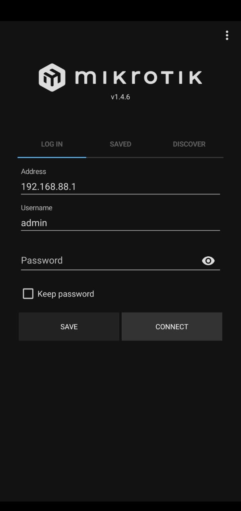

# LAB-1
Senin 11 Agustus 2025

Untuk logging in ke Mikrotik ada beberapa cara:
1. Winbox
2. WebFig
3. Telnet
4. SSH
5. FTP (filezilla)
6. Console
7. Tik App

# 1. Winbox
   Cara pertama yaitu mengunakan aplikasi winbox, dapat didownload di mikrotik.com. Berikut langkah-langkah loginnya:
   1. Buka WinBox
   2. Pindah ke tab "Neighbors"
   3. Setelah muncul, klik pada MAC Address
   4. Isi Login: admin Password: (kosong)
   5. Lalu klik Connect
   6. Jika berhasil, akan muncul tampilan seperti ini.

# 2. WebFig
  Cara kedua yaitu mengunakan WebFig (browser), berikut langkah-langkahnya: 
   1. Buka Browser
   2. Pada URL bar, ketik IP Address default Mikrotik 192.168.88.1
   3. Isi login dan password, Login "admin" password kosongkan.
   
   5. Jika berhasil, akan ada tampilan GUI RouterOS nya.
   

# 3. Telnet
   Cara ketiga adalah mengunakan Telnet pada Putty, berikut ini langkahnya:
   1. Buka Putty
   2. Pilih other dan Di dropdown selection, pilih Telnet
   3. Ketik IP Address default Mikrotik, 192.168.88.1 dan Port 22 (default Mikrotik)
   4. Klik open
   5. Login admin dan tanpa password
   6. Jika berhasil, nanti akan ada tampilan terminal dengan tulisan "Mikrotik" seperti ini.

# 4.SSH
   Cara selanjutnya yaitu mengunakan SSH pada Putty juga:
   1. Buka putty
   2. Pilih SSH
   3. Masukan IP Address dan port default Mikrotik
   4. Klik open
   5. Login dengan user admin dan without password
   6. Jika berhasil, tampilannya akan sama seperti login pada Telnet tadi.

# 5. FTP (filezia)
   Akses Mikrotik via FTP bisa untuk upload dan download file ke router mikrotik, berikut langkahnya:
   1. Buka filezia
   2. Isi Host dengan IP Default Mikrotik, Username isi "admin", password kosongkan dan port 21
   3. Lalu klik quickconnect
   4. Jika berhasil, akan ada tulisan " Dir listing of "/" successful dan di titlebar akan ada user@ip

# 6. Console
   Akses Mikrotik mengunakan kabel Console dan masi di putty, sebagai berikut:
   1. Buka putty
   2. Pilih Serial
   3. Isi serial line dengan nama devicenya, untuk melihat nama devicenya bisa mengunakan Device Manager, dibagian **Ports (COM & LPT)**
   4. Disitu nanti ada nama devicenya **USB Serial Port (COM3)**, gunakan yang dalam kurungnya saja **(COM3)**
   5. Isi speednya dengan default Mikrotik (115200)
   6. Klik Open
   7. Kalau muncul layar kosong, klik enter sekali nanti akan keluar tampilan login
   8. Isi admin dan password kosong

# 7. Mikrotik Pro (sebelumnya Tik App)
   Akses Mikrotik mengunakan handphone, sebagai berikut
   1. Pastikan mode wireless di RB nya sudah nyala
   2. Sambungkan Handphone ke mikrotik melalui Wi-Fi sampai tersambung  
   
   4. Buka Aplikasi Mikrotik Pro
   5. Login dengan user **admin** dan password kosongkan  
   
   6. Jika berhasil, akan muncul tampilan GUI  
   

# Kesimpulan
   Lab ini membahas cara untuk login ke router Mikrotik menggunakan beberapa metode. Setiap metode punya alat, protokol, dan kegunaan berbeda-beda.
